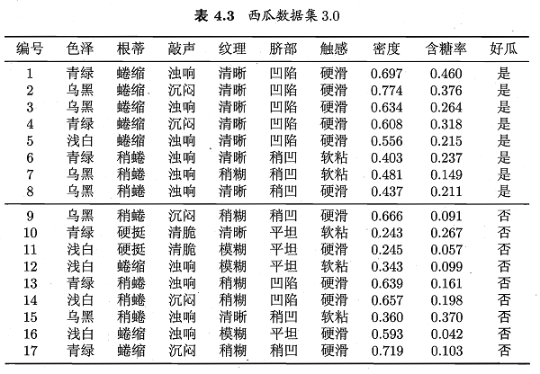
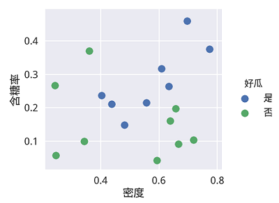
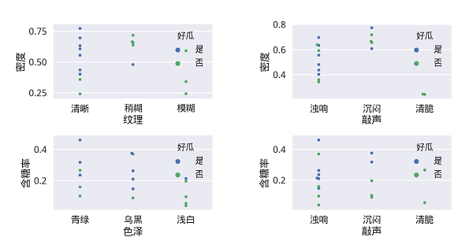
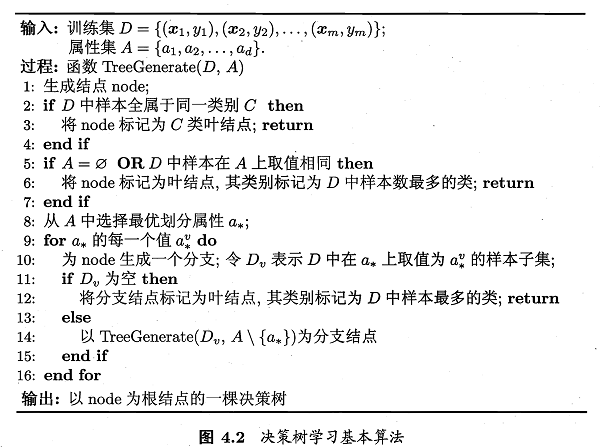
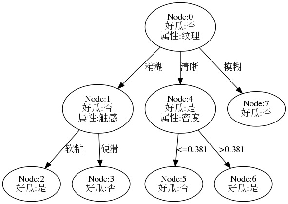

这里采用**Python-sklearn**的方式，环境搭建可参考[ 数据挖掘入门：Python开发环境搭建（eclipse-pydev模式）](http://blog.csdn.net/snoopy_yuan/article/details/61211639).

相关答案和源代码托管在我的Github上：[PY131/Machine-Learning_ZhouZhihua](https://github.com/PY131/Machine-Learning_ZhouZhihua).

## 4.3 编程实现ID3算法 ##
> 
> 

这里采用了自己编程实现和调用sklearn库函数两种不同的方式，详细解答和编码过程如下：（[查看完整代码](https://github.com/PY131/Machine-Learning_ZhouZhihua/tree/master/ch4_decision_tree/4.3_ID3)）：

### 1.获取数据、查看数据、预分析 ###

这里由数据表生成.csv文件（注意**中文字符的编码格式**）。采用**pandas**.read_csv()读取数据，然后采用**seaborn**可视化部分数据来进行初步判断。

观察数据可知，变量包含'色泽'等8个属性，其中6个**标称属性**，2个**连续属性**。类标签为西瓜是否好瓜（两类）：

下面是一些数据可视化图像：

下图是含糖率和密度两个连续变量的可视化图，这个图在之前的练习中也有出现：

下图则是更多的变量两两组合可视化图：

基于可视化手段进行一些分析，看以大概了解数据的分布及其与类别的关系。

### 2.自己编程实现ID3算法 ###
	
在进行编程之前，先做一些分析如下：

- 对于树形结构，可以创建**节点类**来进行操作，根据书p74决策树基本算法，广泛采用**递归操作**；
- 对于连续属性（密度、含糖率），参考书p83，对其进行**离散化**（可采用二分法）；
- 对于标称属性（色泽、纹理等），考虑**Python字典**，方便操作其特征类别（如：'色泽' -> '青绿'，'乌黑'，'浅白'）；
- 由于数据集完整，这里暂不考虑缺值问题（若需考虑，可参考书p86-87的加权思路 -> C4.5算法）；

下面是实现过程：

##### 2.1 建立决策树节点类 #####

该节点类包含当前节点的属性，向下划分的属性取值，节点的类标签（叶节点有效，为通用性而保留所有节点类标签）；

样例代码如下：

	'''
	definition of decision node class
	
	@variable attr: attribution as parent for a new branching 
	@variable attr_down: dict: {key, value}
		        key:   categoric:  categoric attr_value 
		               continuous: '<=div_value' for small part
		                           '>div_value' for big part
		        value: children (Node class)
	@variable label： class label (the majority of current sample labels)
	''' 
	class Node(object): 
	    def __init__(self, attr_init=None, attr_down_init={}, label_init=None):  
	        self.attr = attr_init  
	        self.attr_down = attr_down_init
	        self.label = label_init  

##### 2.2 递归实现决策树生成算法主体 #####

基本的决策树生成算法参照书p74-图4.2，如下所示：

> 

下面是算法主体代码，注意对连续变量和离散变量的不同操作：

    
	''' 
	Branching for decision tree using recursion 
	 
	@param df: the pandas dataframe of the data_set
	@return root: Node, the root node of decision tree
	'''  
	def TreeGenerate(df):
	    # generating a new root node
	    new_node = Node(None, None, {})
	    label_arr = df[df.columns[-1]]
	    
	    label_count = NodeLabel(label_arr)
	    if label_count:  # assert the label_count isn's empty
	        new_node.label= max(label_count, key=label_count.get) 
	            
	        # end if there is only 1 class in current node data
	        # end if attribution array is empty
	        if len(label_count) == 1 or len(label_arr) == 0:
	            return new_node
	        
	        # get the optimal attribution for a new branching
	        new_node.attr, div_value = OptAttr(df)
	        
	        # recursion
	        if div_value == 0:  # categoric variable
	            value_count = ValueCount(df[new_node.attr]) 
	            for value in value_count:
	                df_v = df[ df[new_node.attr].isin([value]) ]  # get sub set
	                # delete current attribution
	                df_v = df_v.drop(new_node.attr, 1)  
	                new_node.attr_down[value] = TreeGenerate(df_v)
	                
	        else:  # continuous variable # left and right child
	            value_l = "<=%.3f" % div_value
	            value_r = ">%.3f" % div_value
	            df_v_l = df[ df[new_node.attr] <= div_value ]  # get sub set
	            df_v_r = df[ df[new_node.attr] > div_value ]
	 
	            new_node.attr_down[value_l] = TreeGenerate(df_v_l)
	            new_node.attr_down[value_r] = TreeGenerate(df_v_r)
	        
	    return new_node
    

##### 2.3 最优划分属性选择-信息增益判断 #####

**ID3算法**采用**信息增益最大化**来实现最优划分属性的选择，这里主要的挑战是离散和连续两种属性变量的分别操作。对于离散变量（categoric variable），参考书p75-77内容实现，对于连续变量（continuous variable），采用书p83-85所介绍的**二分法**实现。

相关内容如**信息熵、信息增益最大化、二分法**等可参考书p75-76及p84页内容。

具体的实现代码：[查看完整代码](https://github.com/PY131/Machine-Learning_ZhouZhihua/blob/master/ch4_decision_tree/4.3_ID3/src/decision_tree.py)。

如下所示为综合了离散类别变量和连续变量的信息增益计算代码实现：

	'''
	calculating the information gain of an attribution
	 
	@param df:      dataframe, the pandas dataframe of the data_set
	@param attr_id: the target attribution in df
	@return info_gain: the information gain of current attribution
	@return div_value: for discrete variable, value = 0
	               for continuous variable, value = t (the division value)
	'''  
	def InfoGain(df, index):
	    info_gain = InfoEnt(df.values[:,-1])  # info_gain for the whole label
	    div_value = 0  # div_value for continuous attribute
	    
	    n = len(df[index])  # the number of sample

	    # 1.for continuous variable using method of bisection
	    if df[index].dtype == (float, int):
	        sub_info_ent = {}  # store the div_value (div) and it's subset entropy
	        
	        df = df.sort([index], ascending=1)  # sorting via column
	        df = df.reset_index(drop=True)
	        
	        data_arr = df[index]
	        label_arr = df[df.columns[-1]]
	        
	        for i in range(n-1):
	            div = (data_arr[i] + data_arr[i+1]) / 2
	            sub_info_ent[div] = ( (i+1) * InfoEnt(label_arr[0:i+1]) / n ) \
	                              + ( (n-i-1) * InfoEnt(label_arr[i+1:-1]) / n )
	        # our goal is to get the min subset entropy sum and it's divide value
	        div_value, sub_info_ent_max = min(sub_info_ent.items(), key=lambda x: x[1])
	        info_gain -= sub_info_ent_max
	        
	    # 2.for discrete variable (categoric variable)
	    else:
	        data_arr = df[index]
	        label_arr = df[df.columns[-1]]
	        value_count = ValueCount(data_arr)
	            
	        for key in value_count:
	            key_label_arr = label_arr[data_arr == key]
	            info_gain -= value_count[key] * InfoEnt(key_label_arr) / n
	    
	    return info_gain, div_value

##### 2.4 划分训练集和测试集进行测试 #####

首先给出**预测函数**，采用简单的向下搜索即可实现。[查看完整代码](https://github.com/PY131/Machine-Learning_ZhouZhihua/blob/master/ch4_decision_tree/4.3_ID3/src/decision_tree.py)。

	

通过多次划分训练集和测试集，评估出所生成的完全决策树的预测精度，下面是几种不同情况下的结果和分析：

- 训练集为整个数据样本的情况：

	    accuracy: 1.000  1.000  1.000  1.000  1.000  1.000  1.000  1.000  1.000  1.000  
	    average accuracy: 1.000

	此时预测准度为100%，结果证明了**题4-1**。

	采用**pydotplus.graphviz**绘图库，可以画出这样一棵完全决策树如下图（[点击查看绘图程序](https://github.com/PY131/Machine-Learning_ZhouZhihua/blob/master/ch4_decision_tree/4.3_ID3/src/decision_tree.py)）：
	
	

- 训练集与测试集各取一半：

		accuracy: 0.556  0.778  0.333  0.778  0.444  0.333  0.667  0.444  0.778  0.333  
		average accuracy: 0.544

	多次实验预测准度均在55%左右（几乎等同于随机预测），说明此时模型无实用性。

- 按照K折交叉验证模型（k=5）：

		accuracy: 1.000  0.000  0.667  1.000  0.000  
		average accuracy: 0.533

	结果精度依然很不理想，可以看到，不同的训练集与测试集的划分导致结果差别很大，这主要是由于数据量太少的缘故。

- 只分析离散属性：

		accuracy: 1.000  0.000  0.333  0.667  0.000  
		average accuracy: 0.400

	此时由于特征信息减少，模型更差了。

综上，为提高决策树泛化预测精度，需要进一步对其进行**剪枝**。

关于剪枝实现可参考下一题。

----

相关参考：

1.seaborn/matplotlib可视化、中文字符处理：

 - [seaborn官网 - Plotting with categorical data](http://seaborn.pydata.org/tutorial/categorical.html)
 - [seaborn显示中文 - The solution of display chinese in seaborn plot](https://github.com/mwaskom/seaborn/issues/1009)
 - [Linux下解决matplotlib中文乱码的方法](https://segmentfault.com/a/1190000000621721)
 - [Unicode和Python的中文处理](http://www.cnblogs.com/TsengYuen/archive/2012/05/22/2513290.html)

2.python基础知识： 

 - [Python学习 - python字典](http://blog.csdn.net/moodytong/article/details/7647684)
 - [Python从字符串中提取数字 - 正则表达式](https://zhidao.baidu.com/question/328905513600600605.html)

3.决策树绘制相关：

 - [sklearn官网 - Decision Trees](http://scikit-learn.org/stable/modules/tree.html)
 - [pydotplus官网 - graphviz的API](http://pydotplus.readthedocs.io/reference.html#module-pydotplus.graphviz)
 - [GraphViz常用属性学习笔记](https://wenku.baidu.com/view/207d623b76a20029bc642de0.html)
 - [pydot包的安装和使用](http://www.aiuxian.com/article/p-835489.html)
 
----

