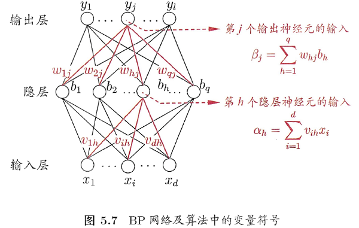
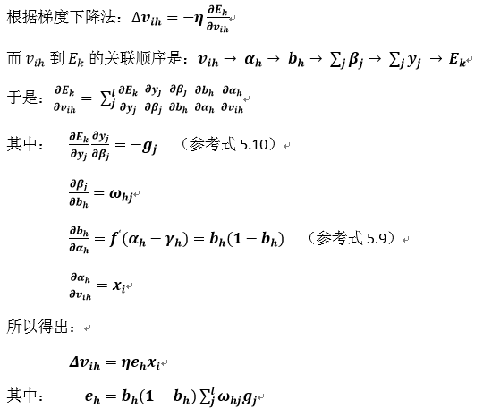

本章所涉及的编程练习采用**Python**实现，查看相关答案和源代码，欢迎访问我的Github：[PY131/Machine-Learning_ZhouZhihua](https://github.com/PY131/Machine-Learning_ZhouZhihua).

## 本章概要 ##

本章讲述**人工神经网络**（Artificial Neural Network，ANN），相关内容包括：

- 神经元模型（neuron）

> M-P神经元模型，带权的连接，阈值（threshold），激活函数（activation function），Sigmoid函数；

- 感知机（Perceptron）与多层网络（multi-layer networks）

> 感知机网络，线性可分，隐含层（hidden layer），单隐层网络，多层前馈神经网络（multi-layer feedforward neural networks）；

- 误差逆传播算法（BP algorithms）

> BP算法，BP网络，梯度下降法，学习率，标准BP算法，累积BP算法，隐层神经元个数调整-试错法（trial-by-error），过拟合问题，早停（early-stopping），正则化（regularization）；

- 全局最小与局部最小

> 全局最小（global minimum），局部最小（local minimum），多初始化，模拟退火（simulated annealing），随机梯度下降；

- 其他常见神经网络模型

> RBF网络，径向基函数（RBF），高斯径向基函数；

> ART网络，竞争性学习（competitive learning），比较层，识别层，模式类，识别阈值，可塑性-稳定性窘境，增量学习；

> SOM网络，高维到低维映射，最佳匹配单元，距离；

> 级联相关网络（cascade-correlation），结构自适应，相关性；

> Elman网络，递归神经网络，状态反馈，推广BP算法；

> Boltzmann机，基于能量（energy）的模型，能量最小化，布尔型神经元，受限Boltzmann机（RBM），对比散度（contrastive divergence）；

- 深度学习简介

> 多隐层，无监督逐层训练（unsupervised layer-wise training），预训练-微调，深度信念网络（DBN），权共享（weight sharing），卷积神经网络（CNN），特征学习（feature learning），特征工程（feature engineering）；

## 神经网络的优劣总结 ##

人工神经网络的好处很多，这里不做赘述，下面列出一些在使用神经网络方法时，需要注意的问题：

 - 算法收敛速度问题

 - 过拟合风险

 - 局部最优风险
 
 - 网络结构选择问题

 - 样本依赖问题

 - 黑盒模型缺陷
	

## 课后练习 ##

#### 5.1 神经元激活函数选择考虑 ####
> 

激活函数的选取是很灵活的，不同层可选择不同的激活函数，但一般都会要求满足非线性。若为线性（即形如题中 f(x)=wx ），根据多项式组合法则，**多层网络退化成等价的单层网络**，此时模型成为线性模型，无法解决非线性问题，如线性不可分的分类问题。

进一步，激活函数一般会追求以下性质：

 - 非线性，内在反映的是模型的非线性；
 - 可微性，以支持梯度下降法等基于微分的优化方法；
 - 单调性，以保证单层网络是凸约束，从而存在最优；
 - 输出值范围受限，当输出有限时，寻优算法（如梯度下降）变得更加稳定；
 - 导数可由原函数计算出，以便重复利用；
 - ...

最常用的激活函数有：Sigmoid（对数几率函数），Tanh（双曲正切函数），ReLUs（修正线性函数），RBF（径向基函数），softmax（归一化指数函数）...

----

#### 5.2 Sigmoid激活函数与对率回归的联系 ####
> 

图5.2(b)采用Sigmoid函数作为激活函数，相当于将每个节点视为**对率回归分类器**，其系数为输入连接的权值ω（包括阈值对应的哑变量-1系数θ）；

----

#### 5.3 BP算法推导 ####
> 

图如下所示：

> 

参数 vih 的更新公式为（书公式5.5）：

> 

其中 Δvih 如下（书上公式5.13）：

> 

给出具体的推导过程如下：

> 

----

#### 5.4 学习率取值分析 ####
> 
> 

学习率 η 控制着梯度下降法的搜索步长（相关内容可参考书p408-附录B.4的梯度下降法的内容）：

对于固定的 η，参考书p109页： η 过大，收敛过程易振荡， η 过小，收敛速度过慢。

常把学习率 η 设置为随迭代次数变化的量，使其随着训练的要求变化而变化（一般是减小）。如刚开始 η 大以快速到达到目标值附近， 后期 η 小以保证收敛稳定。

----

#### 5.5 BP算法实验 ####
> 

参考书p105，标准BP算法和累积BP算法的最大区别在于**梯度下降法的实现**，前者采用**随机梯度下降法**原理，后者采用**标准梯度下降法**，相关可参考题3.3对率回归中的两种梯度下降法的实现。

编程采用python-pybrain实现。本题的详细过程见：

[周志华《机器学习》课后习题解答系列（六）：Ch5.5 - BP算法实现](http://blog.csdn.net/snoopy_yuan/article/details/70230862)

----

#### 5.6 BP算法改进 ####
> 

这里采用“**添加动量项+自适应学习率**”机制来加快BP算法收敛。详细过程见：

[周志华《机器学习》课后习题解答系列（六）：Ch5.6 - BP算法改进](http://blog.csdn.net/snoopy_yuan/article/details/70846554)

----

#### 5.7 RBF神经网络实验 ####
> 

详细过程见：

[周志华《机器学习》课后习题解答系列（六）：Ch5.7 - RBF网络实验](http://blog.csdn.net/snoopy_yuan/article/details/71024046)

----

#### 5.8 SOM神经网络实验 ####
> 

详细过程见：

[周志华《机器学习》课后习题解答系列（六）：Ch5.8 - SOM网络实验](http://blog.csdn.net/snoopy_yuan/article/details/71093910)

----

#### 5.9 Elman网络的BP算法推导 ####
> 

这里简单说说思路：

Elman神经网络是一种**递归神经网络**（RNN），它将上一次隐层输出和当前输入一起作为隐层输入（**反馈**feedback），从而实现网络的“**记忆**”功能。

Elman训练算法以MLP-BP算法为基础，但是在计算隐层梯度时，要考虑由于反馈而产生的时序项，所以在训练算法中存在累加项。更多内容可以参考[RECURRENT NEURAL NETWORKS TUTORIAL](http://www.wildml.com/2015/10/recurrent-neural-networks-tutorial-part-3-backpropagation-through-time-and-vanishing-gradients/)。

递归神经网络正广泛应用于自然语言处理（NLP）等新兴领域。

----

#### 5.10 卷积神经网络实验 ####
> 

本章最后一题，详细过程见：

[周志华《机器学习》课后习题解答系列（六）：Ch5.10 - 卷积神经网络实验](http://blog.csdn.net/snoopy_yuan/article/details/71703019)

----

